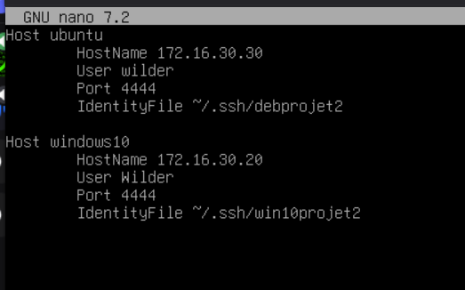
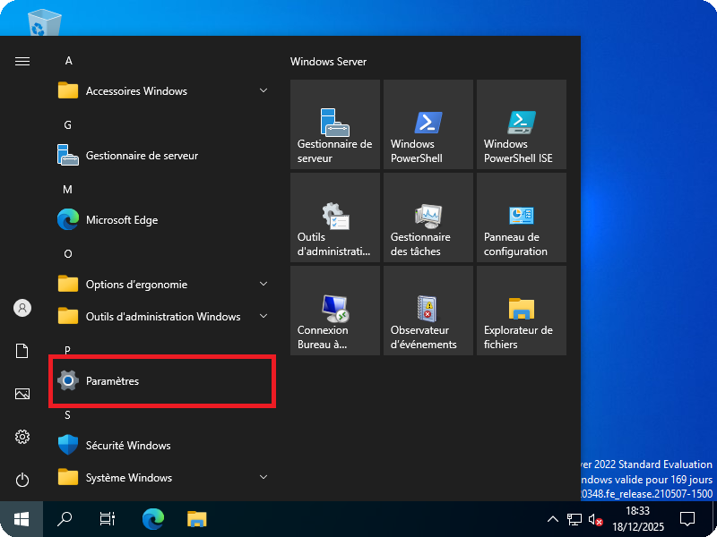
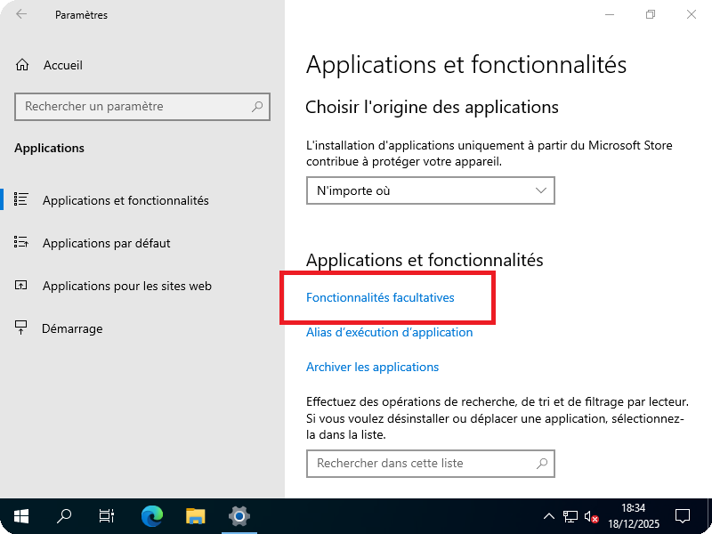
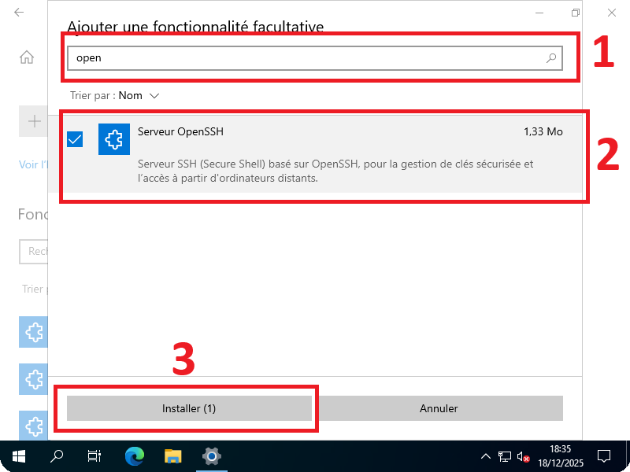
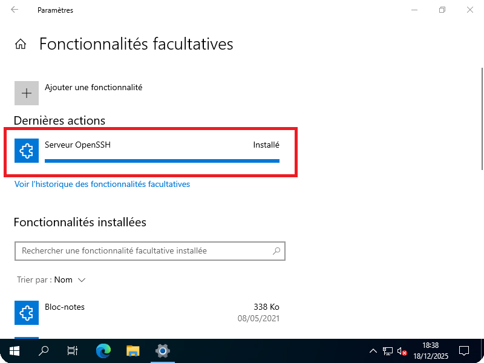
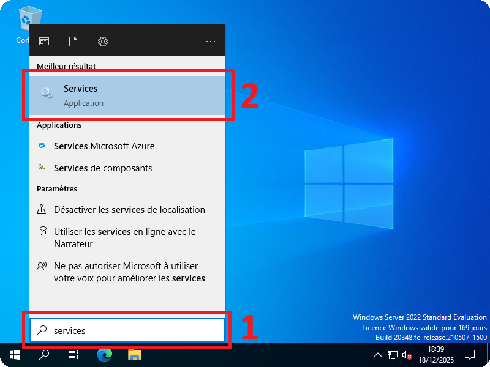
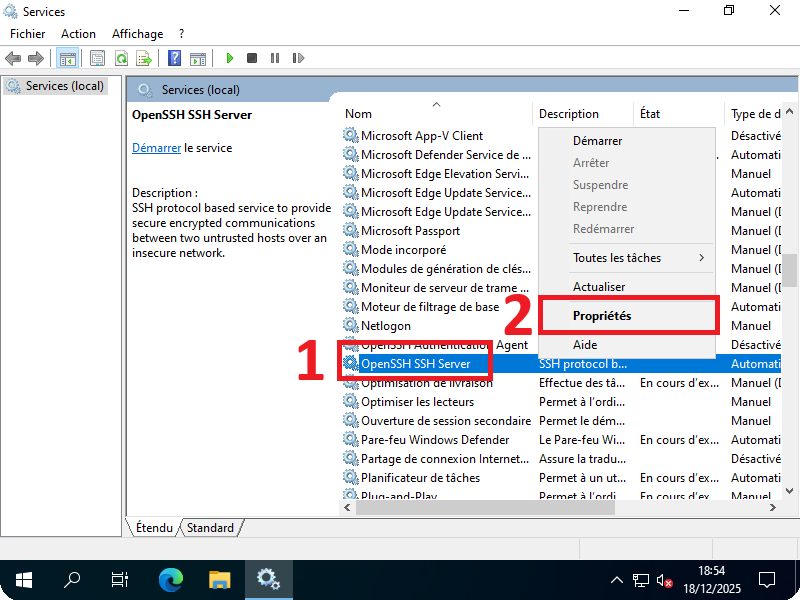
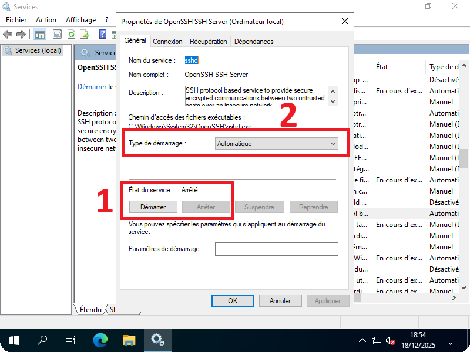
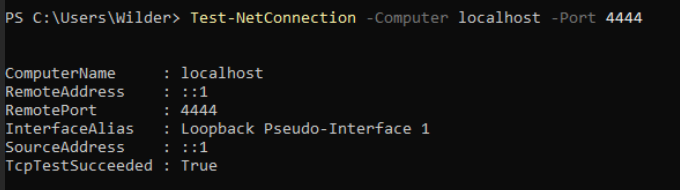
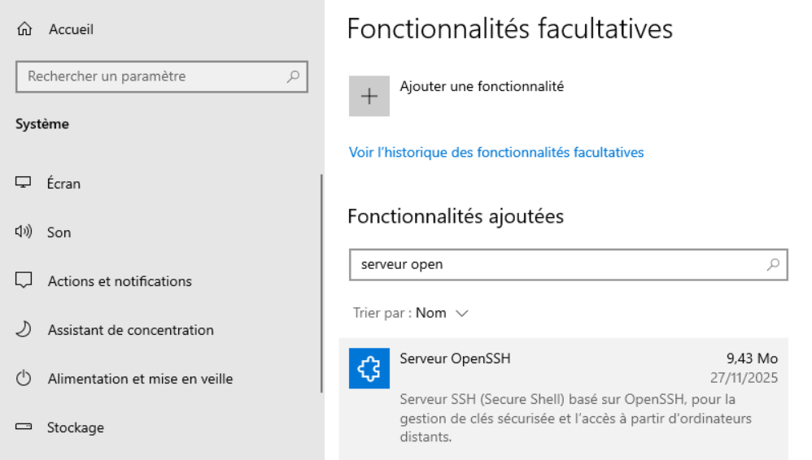

## Sommaire

1. [Prérequis technique](#1-prérequis-techniques)

2. [Configuration sur le serveur Debian ( Debian 12.9 )](#2-configuration-sur-le-serveur-debian--debian-129-)

3. [Configuration sur le serveur Windows ( Windows serveur 2022 )](#3-configuration-sur-le-serveur-windows--windows-serveur-2022-)

4. [Configuration sur le client Linux (Ubuntu 24.04 LTS)](#4-configuration-sur-le-client-linux-ubuntu-2404-lts)

5. [Configuration sur le client Windows ( Windows 10 )](#5-configuration-sur-le-client-windows--windows-10-)

6. [FAQ](#6-faq)

## 1. Prérequis techniques  

4 machines Virtuelle sous **PROXMOX** :
Groupe 3
**Réseau: 172.16.30.0/24**
**BROADCAST: 172.16.30.254**  
**DNS : 8.8.8.8**  

- **Serveur Debian** :
 Nom : **srvlx01**  
 IP : **172.16.30.10**  

- **Serveur Windows 2022** :  
 Nom : **srvwin01**  
 IP : **172.16.30.5**  

- **Client Windows 10**  :  
 Nom : **cliwin01**  
 IP : **172.16.30.20**  
  
- **Client Linux** :  
 Nom : **clilin01**  
 IP : **172.16.30.30/24**  

Il faut un compte **ROOT** et un compte **wilder** sur le  serveur **Debian**
Il faut un compte **Administrator** et un compte **wilder** sur le **Serveur Windows**  
Il faut un compte utilisateur **wilder** sur les 2 VM **Client Windows** et **Client Linux**  

---  

## 2. Configuration sur le serveur Debian ( Debian 12.9 )

### 2.1 Instalation de open-ssh

- Mettre à jour les paquets avec `sudo apt update`
- Installer open-ssh avec `sudo apt install openssh-server`

### 2.2 Configuration du fichier config  

Si il n'existe pas, créez le fichier config dans ~/.ssh  
`mkdir -p ~/.ssh`  
`nano ~/.ssh/config`

Ajoutez les informations de connection des machines cibles :



IdentityFile renseigne le chemin de la clé RSA utilisé en regard de la clé publique transférée aux machines cibles.

Nous pouvons y renseigner les informations des machines cibles :

### 2.3 Génération des clés RSA

En ligne de commande, pour générer une paire de clés RSA (4096 bits recommandé)  
`ssh-keygen -t rsa -b 4096`
  
  Il est alors de possible de choisir un nom de clé personnalisé ("projet2deb" et "winprojet2" dans notre cas) ou d'appuyer sur Entrée pour obtenir un nom de clé par défaut.

### 2.4 Transfert des clés publiques sur les machines cibles (Ubuntu et Windows 10 dans notre cas)

- Vers Ubuntu :
  - `ssh-copy-id -p 4444 -i ~/.ssh/projet2deb.pub wilder@172.16.30.30`

- Vers Windows 10 :
  - `scp -P 4444 ~/.ssh/projet2deb.pub Wilder@172.16.30.20:C:\Users\Wilder`

Une fois la connection réussie en ssh vers les machines cible à l'aide des clés RSA il sera possible de désactiver l'authentification par mot de passe dans le fichier sshd_config des machine cibles. `PasswordAuthentication yes` => `PasswordAuthentication no`

---  

## 3. Configuration sur le serveur Windows ( Windows serveur 2022 )

### 3.1 Installation de Open-SSH sur Windows Server 2022

#### A) Ouvrir le menu **Démarrer** et cliquer sur Paramètres



#### B) Cliquer sur Applications


#### C) Cliquer sur **Fonctionnalités facultatives**



#### D) Dans la fenêtre qui s'ouvre

1) Entrer le mot **open** dans la barre de recherche
2) Cocher **Serveur OpenSSH**
3) Cliquer sur **Installer**



#### E) Installation de OpenSSH réussie



#### F) Cliquer sur le menu **Démarrer**

1) Entrer le mot **Services**
2) Cliquer sur **Services**



#### G) Chercher **OpenSSH SSH Server** dans la liste

1) Faire un clic droit sur **OpenSSH**
2) Cliquer sur **Propriétés**



#### H) Démarrer le Service automatiquement

1) Cliquer sur **Démarrer**
2) Sélectionner **Automatique** dans *Type de démarrage*



#### I) Le service est installé et opérationnel


---  

### 3.2 Configuration du port SSH (4444)  

#### A) Modifier le fichier de configuration SSH  

1) Ouvrir PowerShell en tant qu'**Administrateur**  
2) Éditer le fichier de configuration :

   ```powershell
   notepad C:\ProgramData\ssh\sshd_config
   ```

3) Modifier ou ajouter ces lignes :

   ```
   Port 4444
   PubkeyAuthentication yes
   PasswordAuthentication no
   PermitRootLogin no
   ```

4) Sauvegarder et fermer le fichier

#### B) Configurer le pare-feu Windows

Autoriser le port 4444 dans le pare-feu :

```powershell
New-NetFirewallRule -Name 'OpenSSH-Server-In-TCP-4444' -DisplayName 'OpenSSH Server (sshd) Port 4444' -Enabled True -Direction Inbound -Protocol TCP -Action Allow -LocalPort 4444
```

#### C) Redémarrer le service SSH

```powershell
Restart-Service sshd
```

#### D) Vérifier que le port est bien ouvert

```powershell
Test-NetConnection -ComputerName localhost -Port 4444
```



---  

### 3.3 Installation du module PSWindowsUpdate

#### A) Ouvrir PowerShell en tant qu'Administrateur

#### B) Installer le module depuis PowerShell Gallery

```powershell
Install-Module -Name PSWindowsUpdate -Force
```

Si demandé, accepter l'installation en tapant **Y** (Yes)

#### C) Importer le module

```powershell
Import-Module PSWindowsUpdate
```

#### D) Vérifier l'installation

```powershell
Get-Module -ListAvailable PSWindowsUpdate
```

---  

## 4. Configuration sur le client Linux (Ubuntu 24.04 LTS)

### 4.1 Instalation de open-ssh

- Mettre à jour les paquets avec `sudo apt update`
- Installer open-ssh avec `sudo apt install openssh-server`

### 4.2 Ouverture du port 4444 pour le service ssh

`sudo ufw allow 4444/tcp`  
`sudo ufw enable`

### 4.3 Configuration du fichier sshd_config

`sudo nano /etc/ssh/sshd_config`

```
Modifiez ou ajoutez ces lignes :

Port 4444
PubkeyAuthentication yes
PasswordAuthentication no
PermitRootLogin no
```

### 4.4 Ajout des clés publiques serveurs

Vérifiez que la clé publique du serveur debian a bien été copié dans le fichier "authorized_keys" dans le dossier ./ssh grace à la commande `ssh-copy-id`

Vérifiez dans le même pour la clé publique du serveur windows.

`cat ~/.ssh/authorized_keys`  

Si ce n'est pas le cas, copiez la clé publique du serveur dans le fichier.
Chaque ligne dans authorized_keys correspond à une clé publique autorisée à se connecter. Vous pouvez en avoir plusieurs (une par machine autorisé).

---  

## 5. Configuration sur le client windows ( Windows 10 )

Ajoutez la fonctionnalité facultative "open-ssh server"



### 5.1 Configuration du fichier sshd_config

Modifiez le fichier de configuration sshd_config situé à l'emplacement C:\ProgramData\ssh\sshd_config en tant qu'administrateur en reprenant/modifiant les mêmes informations que pour la configuration Linux.

### 5.2 Ajout des clés publiques serveurs

Vérifiez que les clés publiques des serveurs Linux et Windows serveur sont présentes dans le fichier administrators_authorized_keys.
Ce fichier doit se trouver dans C:\ProgramData\ssh\administrators_authorized_keys.

### 5.3 Ouverture du port 4444 pour le service ssh

Si un pare-feu est activé, vous devez autoriser les connexions entrantes sur le nouveau port. Utilisez PowerShell en tant qu'administrateur pour exécuter la commande suivante :  

`New-NetFirewallRule -Name sshd -DisplayName 'OpenSSH Server (sshd)' -Enabled True -Direction Inbound -Protocol TCP -Action Allow -LocalPort 4444`

Redemarez le service ssh avec la commande :  

 `Restart-Service sshd`

## 6. FAQ

| Question | Réponse |
|---------|---------|
| **Connexion SSH refusée ou Access Denied** | - Vérifier que la **clé publique SSH** est bien installée<br>- Vérifier que le **pare-feu** est désactivé ou autorise **SSH**<br>- Vérifier que l’**utilisateur est autorisé** dans la configuration `sshd`<br>- Vérifier que les **identifiants utilisateur** fournis sont corrects |
| **Quels sont les prérequis nécessaires** | Avant de pouvoir être contrôlée, chaque machine cliente doit :<br>- Autoriser les connexions **SSH** dans son pare-feu<br>- Avoir le service **OpenSSH** activé<br>- Avoir le **port SSH** ouvert<br>- Vérifier que **OpenSSH Client** est installé (déjà présent sur la plupart des systèmes Windows et Linux)<br>- Recevoir la **clé publique SSH du serveur** pour permettre une connexion sécurisée |
| **Problème réseau : les machines ne communiquent pas entre elles** | Vérifier que :<br>- Toutes les machines sont sur le **même réseau** (`172.16.30.0/24`)<br>- La **passerelle par défaut** est correcte (`172.16.30.254`)<br>- Le **DNS** est configuré (`8.8.8.8`)<br>- Le **pare-feu** n’empêche pas la communication |
| **Les scripts ne s’exécutent pas** | Vérifier que :<br>- Les scripts sont **exécutables** et que l’utilisateur a le **droit de les exécuter**<br>- Pour les scripts **Bash**, le **shebang** est bien présent (`#!/bin/bash`)<br>- Les **extensions de fichiers** sont correctes |
