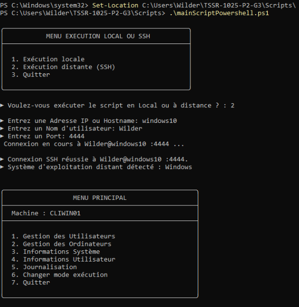

# Guide d’utilisation Scripts d’administration automatisée

## Sommaire
1. [Introduction](#1-introduction)  
2. [Prérequis](#2-prérequis)  
3. [Utilisation du script PowerShell](#3-utilisation-du-script-powershell)  
4. [Utilisation du script Bash](#4-utilisation-du-script-bash)

---

## 1. Introduction

Ce guide décrit l’utilisation de scripts d’administration automatisée permettant d’effectuer des actions d’administration et de récupérer des informations sur des machines connectées en **SSH** au sein du même réseau.

Les scripts disponibles sont :
- Un script **PowerShell** exécuté depuis un **serveur Windows**
- Un script **Bash** exécuté depuis un **serveur Debian**

Ces scripts permettent d’administrer et de superviser des postes clients via une connexion SSH fonctionnelle.

---

## 2. Prérequis

Avant d’exécuter les scripts, les conditions suivantes doivent être respectées :

- Les scripts doivent être **installés** et **exécutables**
- L’utilisateur doit disposer des **droits nécessaires** (administrateur ou sudo)
- Une **connexion SSH fonctionnelle** doit exister entre le serveur et les postes clients  
  (exemples : **CLILIN01, CLIWIN01**)

---

## 3. Utilisation du script PowerShell

Le script PowerShell s’exécute depuis le **serveur Windows**.  
Il peut être utilisé depuis n’importe quel poste capable d’établir une connexion SSH vers la machine hébergeant le script.

### Étapes d’exécution

- Ouvrir **PowerShell** sur le serveur Windows (**SRVWIN01**) en **mode administrateur**
- Le menu **Exécution locale ou SSH** s’affiche automatiquement.
- Après le choix du type d’exécution, le **menu principal** apparaît.
- Vous pouvez alors exécuter des **actions administratives** ou procéder à la **récupération d’informations** à l’aide du script, comme illustré ci-dessous.

    

---

## 4. Utilisation du script Bash

Le script Bash peut être exécuté depuis le **serveur Debian**.  
Il peut être utilisé depuis n’importe quel poste disposant d’un accès **SSH** vers la machine hébergeant le script.

### Étapes d’exécution

- Se connecter au serveur **SRVLX01** avec un compte utilisateur appartenant au **groupe administrateur**
- Se placer dans le dossier contenant le script
- Lancer le script :mainScriptBash.sh
 - Le menu **Exécution locale ou SSH** s’affiche automatiquement.
- Après le choix du type d’exécution, le **menu principal** s’affiche et permet d’exécuter des **actions administratives** ou de **récupérer des informations**, comme illustré ci-dessous.

     
    

  
